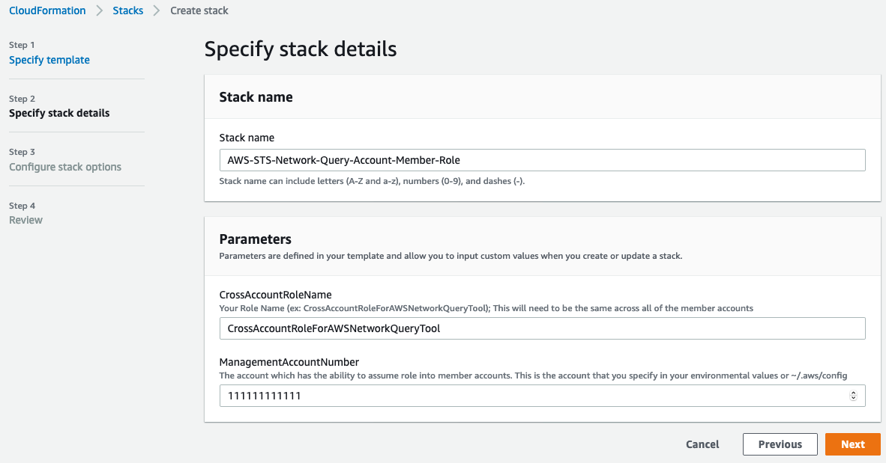
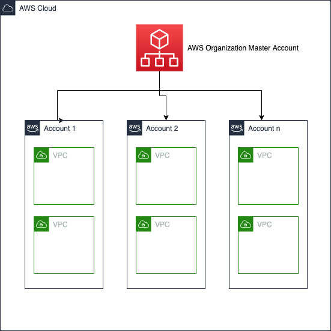

# AWS STS Network Query Tool

## Overview

AWS STS Network Query Tool uses cross account roles to collect networking related information for multiple accounts and outputs a CSV. Users will need to ensure the proper cross account roles are created for each account, details below.

The following queries are supported:
- Internet Gateway (IGW)
- NAT Gateway (NATGW)
- Load Balancer (NLB/ALB)
- VPC CIDR Addresses
- VPC Subnets
- Public Elastic IPs (EIP)
- Elastic Network Interfaces (ENI)

If you would like to see other Networking related information, please submit a feature request.

## Table of Contents

  1. [Prerequisites](#prerequisites)
  1. [Getting Started](#getting-started)
  1. [Examples](#examples)
  1. [Process Overview](#process-overview)
  1. [Contributing](#contributing)
  1. [License](#license)


## Prerequisites
- python3.7+

## Getting Started

Make sure your environmental variables are set or `~/.aws/config` is configured for your AWS organization management account (previously known as master account) or delegated administrator account. The user or role will need to have permission to perform `organizations:ListAccounts`. [More Information.](https://boto3.amazonaws.com/v1/documentation/api/latest/guide/configuration.html)

If you do not want to use an AWS organization management account or delegated administrator, you may specify a list of member accounts to scan by using the `--accounts-csv` option. The script will authenticate against the account specified in your environmental variables or `~/.aws/config`, and from there assume into the role set in `--cross-account-role-name` for accounts specific in the CSV.

Run `python3 setup.py install` in the script directory to install. You can then run `aws_network_query` from the command line.

```
shell$ aws_network_query --help
usage: aws_network_query [-h] [-r CROSS_ACCOUNT_ROLE_NAME] [-o OUTPUT_FILENAME] [-i ACCOUNTS_CSV]
                         [-igw [INTERNET_GATEWAY]] [-natgw [NAT_GATEWAY]] [-elb [LOAD_BALANCER]]
                         [-cidr [VPC_CIDR]] [-subnets [VPC_SUBNETS]] [-eip [ADDRESSES]]
                         [-eni [NETWORK_INTERFACES]] [-all [ALL_REPORTS]]

optional arguments:
  -h, --help            show this help message and exit
  -r CROSS_ACCOUNT_ROLE_NAME, --cross-account-role-name CROSS_ACCOUNT_ROLE_NAME
                        Enter the CrossAccountRoleName that you used in the cross-account-member-role
                        CloudFormation template. Default: CrossAccountRoleForAWSNetworkQueryTool
  -o OUTPUT_FILENAME, --output-filename OUTPUT_FILENAME
                        Choose a filename for the output. Default: output.csv
  -i ACCOUNTS_CSV, --accounts-csv ACCOUNTS_CSV
                        Choose a CSV containing AccountIds. Default: Account IDs will be pulled from AWS
                        Organizations
  -igw [INTERNET_GATEWAY], --internet-gateway [INTERNET_GATEWAY]
                        Activate IGW Report
  -natgw [NAT_GATEWAY], --nat-gateway [NAT_GATEWAY]
                        Activate NATGW Report
  -elb [LOAD_BALANCER], --load-balancer [LOAD_BALANCER]
                        Activate ELB Report
  -cidr [VPC_CIDR], --vpc-cidr [VPC_CIDR]
                        Activate VPC CIDR Report
  -subnets [VPC_SUBNETS], --vpc-subnets [VPC_SUBNETS]
                        Activate VPC Subnet Report
  -eip [ADDRESSES], --addresses [ADDRESSES]
                        Activate EIP Report
  -eni [NETWORK_INTERFACES], --network-interfaces [NETWORK_INTERFACES]
                        Activate ENI Report
  -all [ALL_REPORTS], --all-reports [ALL_REPORTS]
                        Activate all supported reports
```

> Note: This application uses threading to speed up the process of querying the regions of each account.  Users will notice a momentary spike in local machine resources as the threads and sessions are created and the APIs invoked.


### Deploy a Cross-Account IAM role in AWS Member Accounts

This section is applicable for customers who do not have a cross-account role that trusts the Management account in all of the member accounts. In such cases, deploy the following CloudFormation template in all member accounts.

`cross-account-member-role.template`: Use this template to create the cross-account role that the Primary account will assume. The default configuration deploys an AWS Identity and Access Management (IAM) role that trusts the Primary account. A Primary account is the AWS account in which you have set in your environmental values (`AWS_ACCESS_KEY_ID` and `AWS_SECRET_ACCESS_KEY` or `AWS_PROFILE`) or `~/.aws/config`. This can be the Org Management Account, DelegatedAdmin, or another account if you manually enter a list of account ids using the `--accounts-csv` option. You can also customize the template based on your specific needs.

> Note: If you have an IAM role in your member account(s) that trusts the AWS Org Management or DelegatedAdmin account, you can reuse that role. You may need to adjust permissions associated to that role to include AWS managed AmazonEC2ReadOnlyAccess and AmazonVPCReadOnlyAccess permissions policies.

1. Sign in to the AWS Management Console and navigate to [AWS CloudFormation](https://console.aws.amazon.com/cloudformation/home).

2. On the **Create stack** page, select **Upload a template file**, browse to `cross-account-member-role.template`, and choose **Next**.

3. On the **Specify stack details** page, assign a name to your solution stack (ex: `AWS-STS-Network-Query-Account-Member-Role`).

4. Under **Parameters**, review the parameters for the template and modify them as necessary. This solution uses the following default values.

    | Parameter	| Default	| Description |
    | ----------|-------- | ----------- |
    | ManagementAccountNumber | `<Requires input>` | 12-digit account id of the Management/DelegatedAdmin account which has the ability to assume role into member accounts. This is the account that you specify in your environmental values or `~/.aws/config`.|
    | CrossAccountRoleName | `<Requires	input>` | Name of the IAM member Role. This name must be consistent across all the member accounts. eg. `CrossAccountRoleForAWSNetworkQueryTool`|

    

5. Choose **Next**.

6. On the **Configure stack options** page, choose **Next**.

7. On the **Review** page, review and confirm the settings. Be sure to check the box acknowledging that the template will create AWS Identity and Access Management (IAM) resources.

8. Choose **Create stack** to deploy the stack.

You can view the status of the stack in the AWS CloudFormation Console in the **Status** column. You should see a status of `CREATE_COMPLETE` when the role has been created.


## Examples
1. Make sure your environmental variables are set or `~/.aws/config` is configured for your AWS Org Management account (previously known as Master account). [More Information.](https://boto3.amazonaws.com/v1/documentation/api/latest/guide/configuration.html)
1. Make sure the Cross-Account IAM role has been created in AWS Member Accounts. [More Information.](#deploy-a-cross-account-iam-role-in-aws-member-accounts)

#### Generate a report to get a list of Internet Gateways in an AWS Org
1. Make sure the user/role and account set in your environmental variables or `~/.aws/config` has permission to perform `organizations:ListAccounts`. If not, please use the `--accounts-csv` option.

```
shell$ aws_network_query -igw -o myorgreport

Processing Account: 111122223333
Processing Account: 123456789012

Creating new session with role: arn:aws:iam::111122223333:role/CrossAccountRoleForAWSNetworkQueryTool from arn:aws:sts::111111111111:assumed-role/Administrator/email+1@example.com
Creating new session with role: arn:aws:iam::123456789012:role/CrossAccountRoleForAWSNetworkQueryTool from arn:aws:sts::111111111111:assumed-role/Administrator/email+1@example.com
Account 123456789012: AssumeRole success, querying VPC information
Account 123456789012: New Internet Gateway found {'AccountId': '123456789012', 'InternetGatewayId': 'igw-XXXX', 'VpcIds': 'vpc-XXXX', 'Region': 'eu-north-1'}
<trimmed>
================================
FINISHED. Results summary:
A total of 23 Internet Gateways were found. Writing details to myorgreport-igw.csv
```

#### Generate a report to get a list of all supported networking resources from a list of accounts

By default the script will lookup all accounts within the Org. If you want to use a CSV with a list of Account Ids, specify the `accounts-csv` flag which points to a CSV file containing AccountIds under the 'accountid' header.

> Note: You must have the ability to assume role into the accounts listed in the csv from the account defined in your environmental variables or `~/.aws/config`.

```
shell$ cat accounts.csv

accountid
111122223333
123456789012
999999999999
```

```
shell$ aws_network_query -all -i accounts.csv -o specific_accounts_report

Extracting Accounts via File Input
Processing Account: 111122223333
Processing Account: 123456789012
Processing Account: 999999999999
Creating new session with role: arn:aws:iam::111122223333:role/CrossAccountRoleForAWSNetworkQueryTool from arn:aws:sts::111111111111:assumed-role/Administrator/email+1@example.com
Creating new session with role: arn:aws:iam::123456789012:role/CrossAccountRoleForAWSNetworkQueryTool from arn:aws:sts::111111111111:assumed-role/Administrator/email+1@example.com
Creating new session with role: arn:aws:iam::999999999999:role/CrossAccountRoleForAWSNetworkQueryTool from arn:aws:sts::111111111111:assumed-role/Administrator/email+1@example.com
AWSNetworkReport-0d3b22a8-90d8-11eb-a077-acde48001122
Account 111122223333: AssumeRole success, querying VPC information
Account 111122223333: New Internet Gateway found {'AccountId': '111122223333', 'InternetGatewayId': 'igw-XXXX', 'VpcIds': 'vpc-XXXX', 'Region': 'eu-north-1'}
Account 111122223333: New VPC CIDR found {'AccountId': '111122223333', 'VpcId': 'vpc-XXXX', 'CIDR': '172.31.0.0/16', 'Region': 'eu-north-1'}
Account 111122223333: New VPC subnet found {'AccountId': '111122223333', 'SubnetId': 'subnet-XXXX', 'VpcId': 'vpc-XXXX', 'CIDR': '172.31.32.0/20', 'Region': 'eu-north-1'}
<trimmed>
Account 111122223333: New NAT Gateway found {'AccountId': '111122223333', 'NatGatewayId': 'nat-XXXX', 'VpcId': 'vpc-XXXX', 'SubnetId': 'subnet-XXXX', 'Region': 'us-east-1'}
<trimmed>
Account 111122223333: New Elastic IP found {'AccountId': '111122223333', 'PublicIp': '198.51.100.1', 'Region': 'us-east-1'}
<trimmed>
Account 111122223333: New Network Interfaces found {'AccountId': '111122223333', 'NetworkInterfaceId': 'eni-XXXX', 'PrivateIpAddress': '10.1.1.179', 'Status': 'in-use', 'SubnetId': 'subnet-XXXX', 'Region': 'us-east-1'}
<trimmed>
Account 111122223333: New Load Balancer found {'AccountId': '111122223333', 'LoadBalancerArn': 'arn:aws:elasticloadbalancing:us-west-2:111122223333:loadbalancer/app/<removed>', 'DNSName': '<removed>.us-west-2.elb.amazonaws.com', 'VpcId': 'vpc-XXXX', 'Region': 'us-west-2'}
<trimmed>
================================
FINISHED. Results summary:
A total of 23 Internet Gateways were found. Writing details to specific_accounts_report-igw.csv
A total of 3 NAT Gateways were found. Writing details to specific_accounts_report-natgw.csv
A total of 6 Load Balancers were found. Writing details to specific_accounts_report-elb.csv
A total of 24 VPC CIDRs were found. Writing details to specific_accounts_report-cidr.csv
A total of 74 VPC Subnets were found. Writing details to specific_accounts_report-subnets.csv
A total of 3 Elastic IP Addresses were found. Writing details to specific_accounts_report-addresses.csv
A total of 60 Network Interfaces were found. Writing details to specific_accounts_report-eni.csv
```


## Process Overview

#### Example Account Structure



#### Application process flow:
1. Make sure your environmental variables are set or `~/.aws/config` is configured for your Primary account (AWS Org Management, DelegatedAdmin, or other account). [More Information.](https://boto3.amazonaws.com/v1/documentation/api/latest/guide/configuration.html)
1. Install the script by running `python3 setup.py install` in the script directory
1. Start the script by running `aws_network_query`
1. Assumes role in Primary account to list all accounts `organizations:ListAccounts`
   * The script can also use AccountIds from a CSV file. This is useful if you cannot perform `organizations:ListAccounts`
1. Assumes Cross-Account role to each member account to list regions and then performs the requested API calls
1. Returns results and appends a CSV file with the information received
   * CSV file will be stored locally in the same directory that you running the script from

## Contributing

Please see further instructions on contributing in the CONTRIBUTING file.

## License

This sample code is made available under the MIT-0 license. See the LICENSE file.
